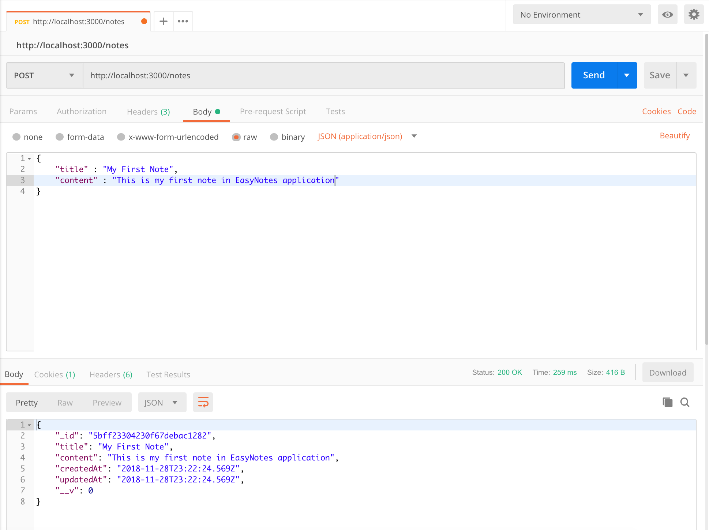

# nodejs-express-mongodb-crud

Run this project by this command : `npm install` then `node index.js`

### Screenshot

Save New Note

Creating a new Note using `POST /notes` API

Get All Notes

Retrieving all Notes using `GET /notes` API

Find One Note

Retrieving a single Note using `GET /notes/:noteId` API

Update One Note

Updating a Note using `PUT /notes/:noteId` API

Delete One Note

Deleting a Note using `DELETE /notes/:noteId` API

